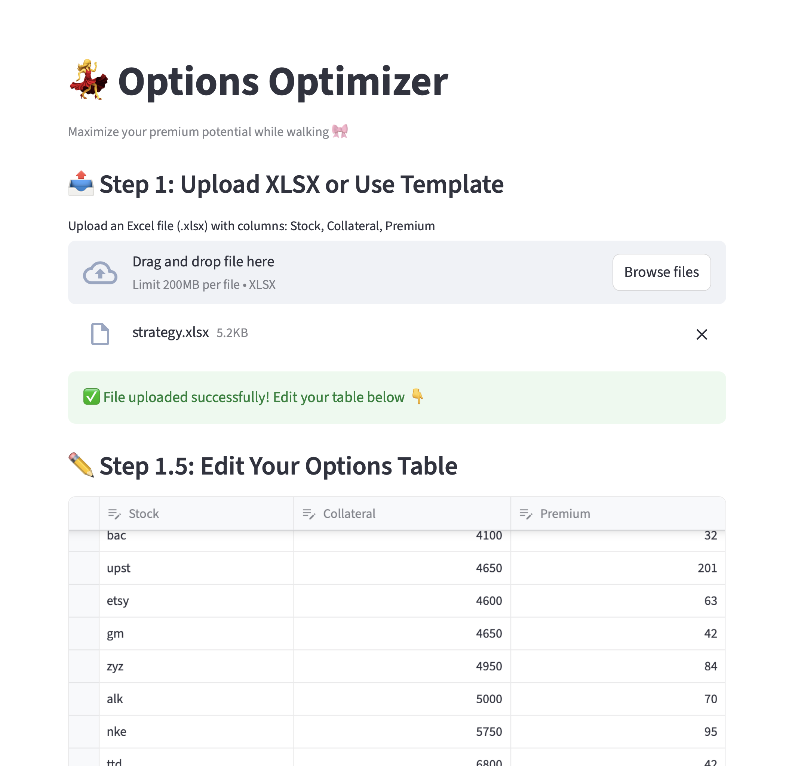
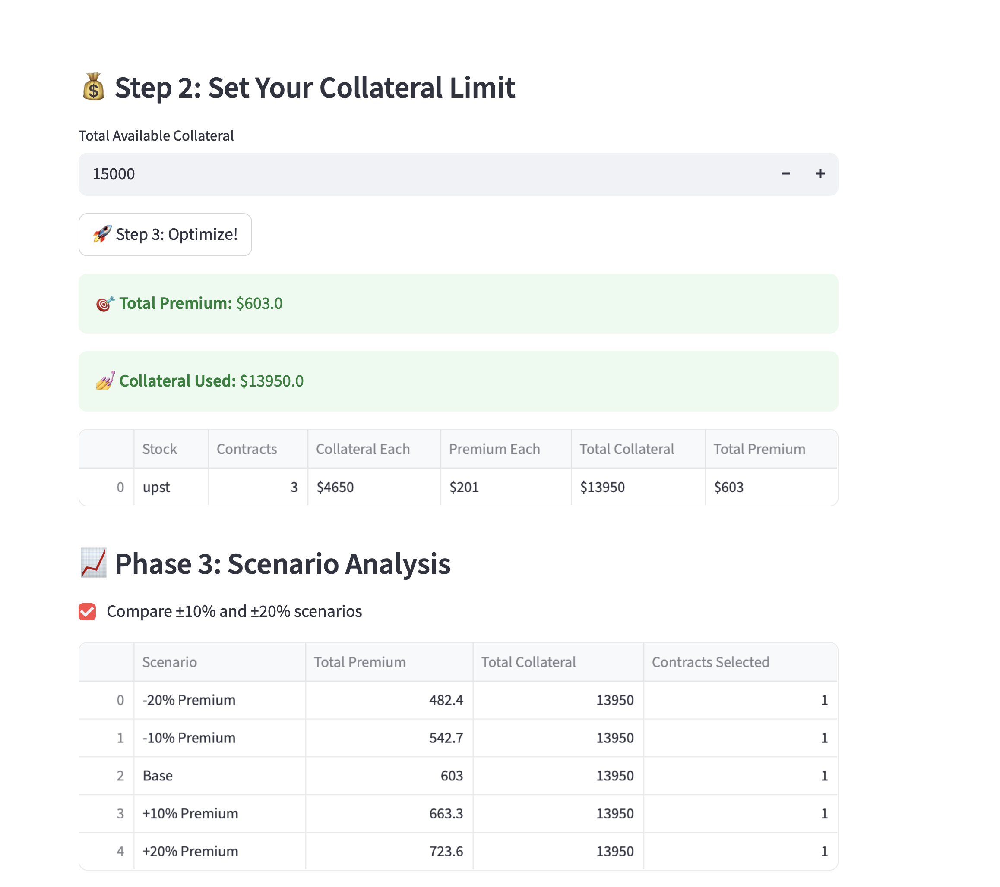
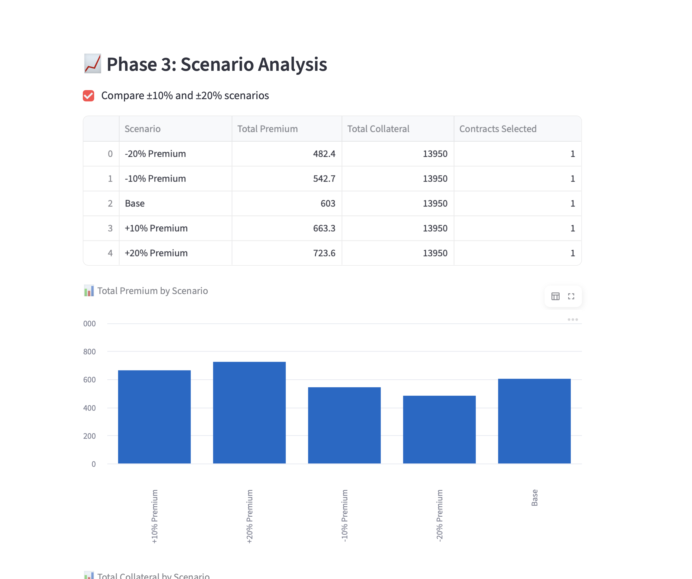

# 💃 Options Optimizer

A **Streamlit web app** that helps you maximize your **options premium** while staying within your **collateral limit** — because smart investing can be as stylish as it is strategic 🎀  

---

## 🧠 Overview

The **Options Optimizer** allows you to:
- Upload or edit a table of stock options with **Stock, Collateral, and Premium** values.  
- Define your **total available collateral**.  
- Automatically calculate the **optimal number of contracts** to maximize your total premium using **linear programming**.  

Behind the scenes, it uses [PuLP](https://coin-or.github.io/pulp/) to solve the optimization problem with an integer linear programming model.

---

## 🖼️ App Screenshots





---

## ⚙️ Tech Stack

- 🐍 **Python 3.9+**
- 📊 **Streamlit** – Interactive web UI
- 🧮 **Pandas** – Data management
- 💪 **PuLP** – Linear optimization solver
- 📘 **OpenPyXL** – Excel file reader
- ✅ **Pytest** – Tests

---

## ✅ Phase 1 Highlights (Portfolio-Ready)

- Clear separation of UI and core optimization logic
- Input validation with helpful errors
- Unit tests for reliability
- Simple, reproducible setup
- Tests passing locally: `python3 -m pytest -q` (Feb 4, 2026)

---

## ✅ Phase 2 Highlights (API + UI Split)

- FastAPI backend with `/optimize` endpoint
- Streamlit frontend calls the API
- Clean interface for future scaling/deployment

---

## ✅ Phase 3 Highlights (Scenario Analysis)

- Compare outcomes under ±10% and ±20% premium scenarios
- Side-by-side table of total premium, collateral, and contracts
- Auto-summary explaining sensitivity to premium changes
- Charts for Total Premium and Total Collateral by scenario

---

## 📖 How to Read the Scenario Analysis

Each row is a “what-if” case where premiums are adjusted:
- **-20% Premium**: premiums are 20% lower than your inputs
- **-10% Premium**: premiums are 10% lower
- **Base**: your original inputs
- **+10% Premium**: premiums are 10% higher
- **+20% Premium**: premiums are 20% higher

**Columns explained**
- **Total Premium**: total premium earned under that scenario
- **Total Collateral**: collateral used (should stay within your limit)
- **Contracts Selected**: number of distinct contracts chosen

**How to interpret quickly**
- If Total Premium changes a lot across scenarios, results are sensitive to premium swings.
- If Contracts Selected changes, the optimizer prefers different contracts under different pricing.

**Charts**
- The **Total Premium** chart shows how earnings change with premium swings.
- The **Total Collateral** chart shows how much collateral gets used in each scenario.

---

## 🚀 Setup & Installation

1. **Clone this repository**
   ```bash
   git clone https://github.com/vttran4/walk-options.git
   cd walk-options
   ```

2. **Create and activate a virtual environment**
   ```bash
   python -m venv venv
   source venv/bin/activate      # On macOS/Linux
   venv\\Scripts\\activate         # On Windows
   ```

3. **Install required python packages**
   ```bash
   pip install -r requirements.txt
   ```

4. **Run the app**
   ```bash
   streamlit run app.py
   ```

5. **Run tests**
   ```bash
   pytest
   ```

---

## 🔌 Phase 2: Run API + UI

1. **Start the API**
   ```bash
   uvicorn api:app --reload
   ```

2. **Start the UI (in another terminal)**
   ```bash
   streamlit run app.py
   ```

3. **Optional: Set API URL**
   ```bash
   export OPTIMIZER_API_URL="http://127.0.0.1:8000"
   ```

4. **One-command dev start**
   ```bash
   ./scripts/run-dev.sh
   ```

---

## 📁 Project Structure

```
core/
  optimizer.py        # Optimization logic (PuLP)
  validation.py       # Input checks
tests/
  test_optimizer.py   # Unit tests
app.py                # Streamlit UI
api.py                # FastAPI backend
```
